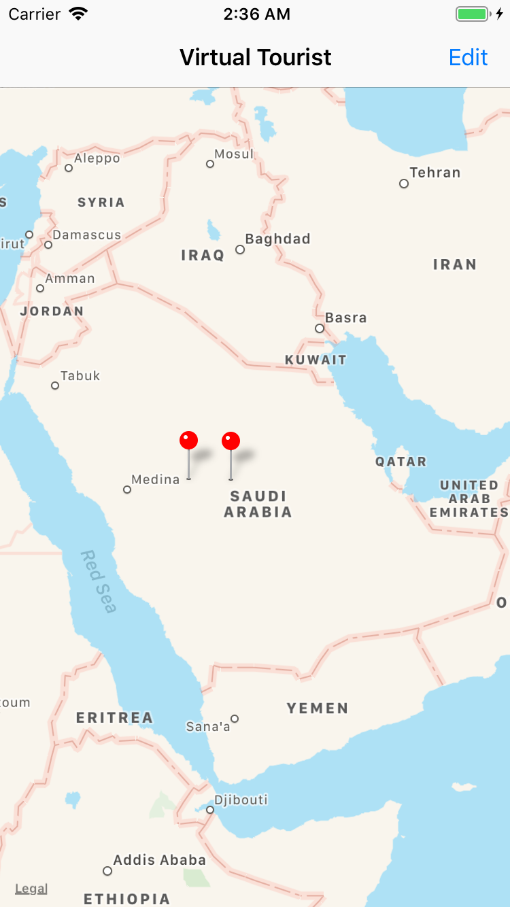
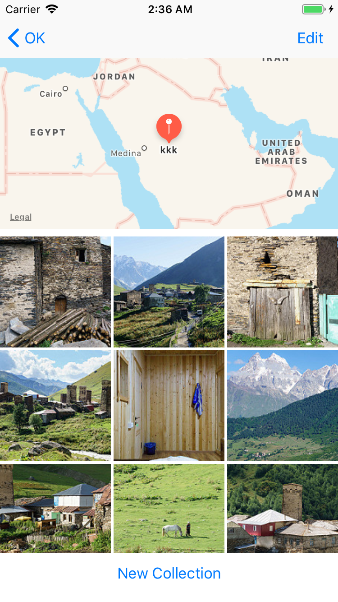
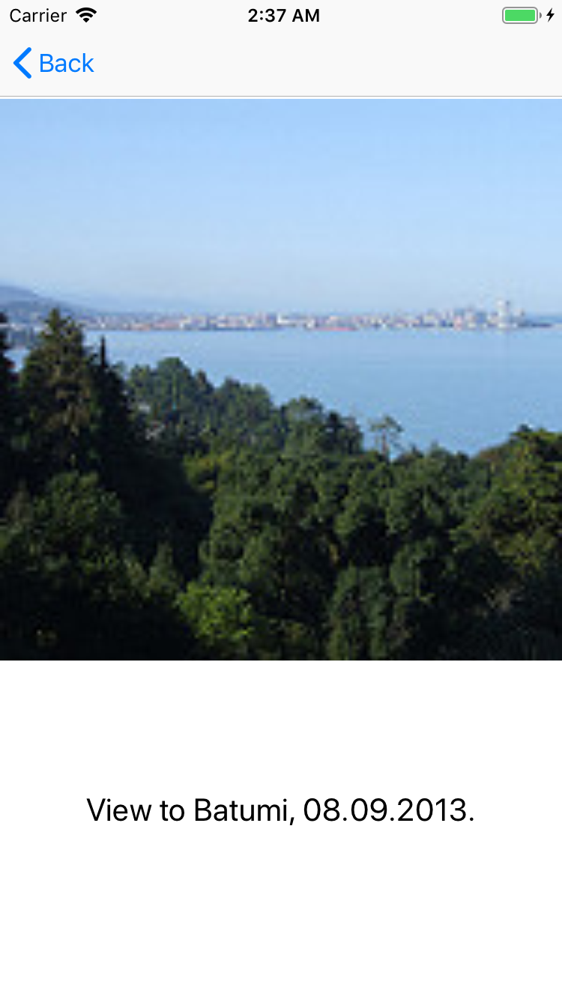

# Virtual Tourist

This application was created purposely for the [Udacity iOS Developer Nanodegree](https://www.udacity.com). It allows users to search for photos in different locations.

**The application offers the following features:**
* Users will be able to zoom and scroll around the map using standard pinch and drag gestures. 
* Tapping and holding the map drops a new pin. Users can add a title to the pin.
* When a pin is tapped, the app will download Flickr images associated with the latitude and longitude of the pin and save it to the device.
* If the user selects a pin that already has a photo album then it will be displayed in the photos collection view.
* Tapping 'New Collection' button will empty the photo album and fetch a new set of images.
* Users can remove photos from an album by clicking 'Edit' and then tapping the photo to delete .

# How to Run
- Download the project to your computer.
- open the .xcodeproj file from the folder. the project will open in Xcode
* Register on [Flickr](https://www.flickr.com) and get your Flickr [API key](https://www.flickr.com/services/apps/create/).
* Replace `APIKey` text in `FlickrParameterValues` in `Flicker API/Constants.swift` file by your **api** key.
* Run the project either using the iPhone simulator or your device.

# Screen Shots

